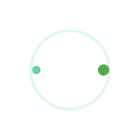

# LuminaLoader

[](https://github.com/ehsanzareix/LuminaLoader/actions/workflows/ci.yml) [](https://github.com/ehsanzareix/LuminaLoader/actions/workflows/visual.yml) [](https://github.com/ehsanzareix/LuminaLoader/actions/workflows/release.yml)

Lightweight, framework-agnostic loader with custom logo support.

Deployed Storybook: https://ehsanzareix.github.io/LuminaLoader/

Quick start

```html
<script type="module">
  import { createLoader } from 'lumina-loader';
  const loader = createLoader({ target: '#app', size: 64 });
  loader.show();
  setTimeout(() => loader.hide(), 2000);
</script>
```

See `demo/` for a minimal example.

### Image / logo loader

Use the `image` type to show a custom image or logo as a loader. Pass an `image` URL or an inline `SVGElement`. Example:

```ts
import { createLoader } from 'lumina-loader';
const loader = createLoader({
  target: '#app',
  type: 'image',
  image: '/logo.svg',
  size: 80,
  imageAnimation: 'rotate',
});
loader.show();
```

Supported `imageAnimation` values: `rotate`, `pulse`, `scale`.

### Determinate progress

LuminaLoader supports determinate progress in `linear` or `circular` variants. Example:

```ts
const loader = createLoader({
  target: '#app',
  type: 'progress',
  progressVariant: 'linear',
  progress: 30,
  size: 200,
});
loader.show();
loader.setProgress(50);
```

### Overlay & backdrop

Show the loader as a full-screen overlay with a backdrop and focus trapping:

```ts
const loader = createLoader({
  target: '#app',
  type: 'spinner',
  overlay: true,
  backdrop: { opacity: 0.6, clickToClose: true },
});
loader.show();
```

Options:

- `overlay`: `true` | `'fullscreen'` | `'inline'` (default `true` shows fullscreen)
- `backdrop`: `{ opacity, blur, color, clickToClose }`
- `overlayZIndex`: number

### Loader types

Lumina supports several built-in loader styles via the `type` option. Use `size`, `color`, and `speed` to tune appearance and motion:

- `spinner` — a classic rotating spinner
- `dots` — three pulsing dots
- `bars` — rising bars rhythm
- `pulse` — concentric expanding rings
- `gradient-ring` — a conic-gradient ring with soft glow
- `orbit` — orbiting dots (planetary motion)
- `wave` — wave-like horizontal bars
- `image` — custom image or SVG (see Image / logo loader above)
- `progress` — determinate progress (linear or circular)

Example:

```ts
createLoader({
  target: '#app',
  type: 'gradient-ring',
  size: 64,
  color: '#4fa94d',
  speed: 1.2,
});
```

### Design tokens & theming

For easy global theming and consistent sizing, Lumina exposes a few CSS custom properties that you can set on `:root` or any container:

- `--lumina-size` — base size (px)
- `--lumina-color` — accent color used by most loaders
- `--lumina-spin-speed` — spin/animation duration (s)
- `--lumina-ease` — easing curve used for animations

The loader respects the user's `prefers-reduced-motion` setting and also supports a `theme` option (`auto` | `light` | `dark`) to adapt coloring.

Example:

```css
:root {
  --lumina-color: #4fa94d;
  --lumina-size: 48px;
  --lumina-spin-speed: 1s;
}
```

### Visual previews

Quick visual references for each `type` (SVG thumbnails are in `docs/assets/`):

| Type          | Preview                                         |
| ------------- | ----------------------------------------------- |
| spinner       |              |
| dots          |                    |
| bars          |                    |
| pulse         |                  |
| gradient-ring |  |
| orbit         |                  |
| wave          |                    |
| image         |                  |
| progress      |            |

> Tip: open the `Design Tokens` page in Storybook to see these thumbnails and try different token values via CSS.

### React (adapter)

A thin React wrapper is available that reuses the core engine. It mounts the loader and destroys it on unmount. Example:

````tsx
import React from 'react';
import { LuminaLoaderReact } from 'lumina-loader/src/adapters/react/LuminaLoader';

export default function App() {
  return (
    <LuminaLoaderReact
      type="image"
      image="/logo.svg"
      imageAnimation="rotate"
      show={true}
    />
  );
}

### Vue (adapter)

A thin Vue 3 wrapper is also available and reuses the core engine. Example:

```vue
<template>
  <LuminaLoader :type="'image'" image="/logo.svg" :show="true" />
</template>

<script setup lang="ts">
import LuminaLoader from 'lumina-loader/src/adapters/vue/LuminaLoader.vue';
</script>
````

---

## Docs & Storybook 📚

Interactive component demos are provided via Storybook for React and Vue adapters.

- Start Storybook locally (React):

```bash
npm run storybook
```

- Start Storybook locally (Vue):

```bash
npm run storybook:vue
```

**Visual tests**

Visual tests run in CI with Playwright; see `docs/visual-testing.md` for how to run them locally and troubleshoot failures.

**Updating the published Storybook**

Storybook is built and deployed automatically from `main` via GitHub Actions (see `.github/workflows/pages-deploy.yml`). To update the published site, push changes to `main`.
